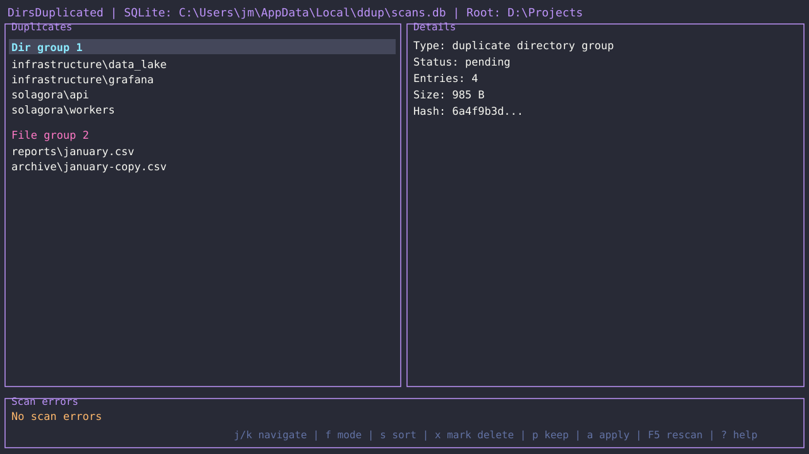

# ddup

CLI/TUI Rust para detectar diretórios e arquivos duplicados.



## Instalação

```powershell
cargo install --path crates/ddup
```

## Uso

```powershell
ddup C:\path\to\scan --mode smart
ddup C:\path\to\scan --mode flat --rescan
ddup C:\left C:\right --mode smart
ddup C:\path\to\scan --db C:\tmp\ddup.sqlite --no-tui
ddup C:\path\to\scan --no-icons
```

Sem `--db`, o SQLite fica em `AppData\Local\ddup\scans.db` no Windows.

Com dois ou mais paths, `ddup` compara duplicatas entre roots e ignora duplicatas locais de um único root.

## Logging

`RUST_LOG` controla logs internos, com default `warn`.

```powershell
$env:RUST_LOG="ddup_core=warn"
ddup C:\path\to\scan --no-tui
```

## Modos

Smart é o default e suprime arquivos duplicados dentro de diretórios já duplicados.

Flat lista todos os arquivos duplicados, mesmo quando a pasta inteira já é duplicada.

A ordenação padrão mostra primeiro grupos com maior tamanho por cópia duplicada.

Use `s` para alternar por tamanho, repetição do grupo e nome.

## TUI

| Tecla | Ação |
|---|---|
| `j/k` ou setas | Navegar |
| `PgUp/PgDown` | Navegar por página |
| mouse | Selecionar e rolar |
| `Enter` | Abrir/fechar grupo |
| `h/l` | Fechar/abrir grupo |
| `f` | Alternar Dirs / Files Smart / Files Flat |
| `s` | Alternar campo de sort |
| `r` | Alternar ordem do sort |
| `Delete` | Deletar item selecionado com confirmação |
| `m` | Mover item selecionado |
| `o` | Abrir no file manager |
| `c` | Copiar caminho completo |
| `i` | Ativar/desativar ícones Nerd Fonts |
| `Space`, `d` ou `x` | Marcar/desmarcar item para delete |
| `K` | Marcar/desmarcar item para manter |
| `u` ou `Backspace` | Limpar marca |
| `a` | Aplicar marcas |
| `F5` ou `Ctrl+R` | Re-scan |
| `?` | Help |
| `q` ou `Esc` | Sair |

Quando o cursor está em `Dir group` ou `File group`, a marca é aplicada a todos os itens do grupo.

## API Rust

```rust
use ddup_core::{scan, scan_roots, ScanMode, WalkConfig};

let result = scan(".".as_ref(), &WalkConfig::default(), ScanMode::Smart, None)?;
let compared = scan_roots(
    &["C:/left".into(), "C:/right".into()],
    &WalkConfig::default(),
    ScanMode::Smart,
    None,
)?;
println!("{}", result.summary.wasted_bytes);
println!("{}", compared.summary.wasted_bytes);
# Ok::<(), ddup_core::CoreError>(())
```

## GUI Integration

O core persiste `tree_nodes` em SQLite com dados prontos para GUI.

Use `Db::fetch_children` para lazy loading de treemap.

Use `Db::fetch_subtree` para sunburst.

`size_recursive`, `dup_status`, `extension`, `wasted_bytes` e `content_hash` já vêm pré-computados.

O core não define cores nem layout; a GUI mapeia `dup_status` e `extension`.

## Testes E2E

```powershell
./scripts/run-e2e.ps1
```
